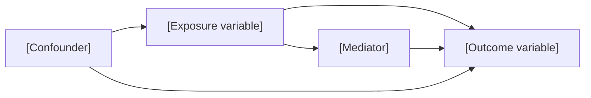

## Overview

A DAG is a causal diagram. Arrows represent hypothesized causal mechanisms — not correlations. The purpose is to make causal assumptions explicit before modeling: identify which variables to control for (confounders), which to leave alone (mediators, colliders), and which are unmeasured.

## Pre-condition

Confirm that the exposure and outcome are already established in the conversation. If not, say so and stop — this process cannot start without them.

## DAG-Building Process

Follow these steps in order. One step at a time — do not rush through them.

---

### Step 1 — Draw the spine

> "Let's build your causal diagram together. We know: **[exposure] → [outcome]**. That's our starting arrow.
>
> Now, thinking about ALL relevant variables — both in your dataset and any you know about from epidemiology even if they're not measured — which ones do you think CAUSE or influence **[exposure]**?"

Wait for the student's answer.

---

### Step 2 — Identify confounders

> "Of the variables that influence **[exposure]**, which ones also independently affect **[outcome]**? Variables that cause BOTH your exposure and your outcome are confounders — we need to control for these in the adjusted model."

Wait. If the student is stuck, prompt from the dataset: "You have [list variables from schema] in your data. Do you think [variable] might influence who gets [exposure] AND whether someone has [outcome]?"

---

### Step 3 — Identify mediators

> "Now think about variables that sit ON THE PATH from **[exposure]** to **[outcome]** — meaning [exposure] causes this variable, which then causes [outcome]. These are mediators. Do you have any?"

Wait. If needed, clarify: "Unlike confounders, mediators are part of HOW the effect works. If we adjust for a mediator, we block the very effect we're trying to measure — so we usually leave them out of the adjusted model."

---

### Step 4 — Identify colliders (brief)

> "Last: are there any variables that are caused by BOTH **[exposure]** AND **[outcome]**? These are colliders. Controlling for a collider can actually introduce spurious associations — so we identify them and do NOT adjust for them."

Wait. If the student can't identify any, that's fine — colliders are often absent from the measured variables.

---

### Step 5 — Generate the mermaid diagram

Build the diagram from the student's answers. Use actual variable names from the dataset. Label exposure and outcome clearly:



For any confounder the student identified that is NOT in the dataset, include it as an unmeasured node:

```mermaid
  U["[Unmeasured confounder] (unmeasured)"] --> exposure
  U --> outcome
```

Show the full diagram to the student.

---

### Step 6 — Validate

> "Does this accurately represent your understanding of the causal structure? Are there any arrows to add, remove, or change?"

Wait. Revise and re-show if needed. When the student confirms, the DAG is done.

---

## DAG Rules (teach as needed during the conversation)

| Rule | Explanation |
|---|---|
| Arrows = causal mechanisms | Not correlations — only draw an arrow if [A] plausibly causes [B] |
| Time ordering | Causes must precede effects — don't draw arrows backward in time |
| Confounders | Common causes of exposure and outcome — must control for these |
| Mediators | On the causal path — do NOT control (blocks the effect being studied) |
| Colliders | Common effects of exposure and outcome — do NOT control (opens spurious path) |
| No cycles | If A → B, B cannot cause A through any path |

## Common Mistakes

- Drawing arrows based on correlation rather than plausible causal mechanism
- Treating mediators as confounders (mediators are downstream of exposure, not upstream)
- Omitting unmeasured confounders — leaving them out hides assumptions; include them as labeled unmeasured nodes
- Treating effect modifiers as confounders — effect modifiers change the SIZE of the effect; confounders are common causes
- Including colliders in the adjustment set — this opens a spurious association, introducing bias
