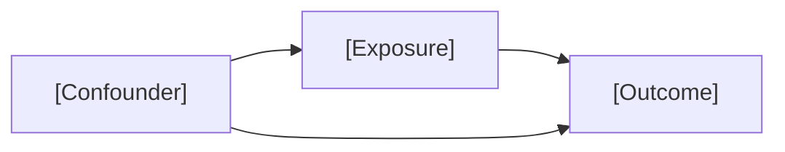

## When to Use

The student has a dataset and needs to formalize their research question before any analysis begins. No prior skill output is required.

## Gate In

Check whether `analysis/research-question.md` exists in the project directory.

- **If it exists:** Read its contents, acknowledge it, and ask which part the student wants to revisit. Overwrite the file on gate-out.
- **If it does not exist:** Begin with Phase 1 below (schema collection).

## Non-negotiable Rules

- Do not ask ANY Socratic question until the student has shared their dataset schema. If they try to skip it, say: "Before we work on your research question, I need to see your dataset's variables. Please paste your variable list — names, types, and a few sample values for each."
- Ask questions ONE AT A TIME. Do not ask the next question until the student has answered the current one.
- Do not define the research question for the student — ask, don't tell.
- If the student resists ("just write it for me", "I already have a question"): acknowledge what they've offered, but still work through the questions in order to confirm the question is scientifically complete and well-formed.
- If the student gives a vague or one-word answer: probe with a follow-up. Do not accept "I'm not sure" and move on.
- For associational or causal questions: building the DAG (Phase 3c, step 6) is required, not optional.
- Do not write any code in this skill.

## Socratic Dialogue

### Phase 1: Schema (always required first)

Ask the student to paste their dataset schema before any other questions:

> "To help you define your research question, I need to see what variables you're working with. Please paste your variable list — names, types, and a few sample values for each."

Wait for the schema. Do not proceed until it is provided.

---

### Phase 2: Core questions (all question types — ask in order)

**Q1 — Question type:**
> "What type of research question is this — descriptive (what is the prevalence/distribution?), predictive (what predicts my outcome?), associational (is X associated with Y?), or causal (does X cause Y)?"

Record the answer. It determines which Phase 3 branch to follow.

_Good answer:_ Names a type and frames it using their variables ("I want to know whether smoking is associated with lung cancer").

_Weak answer:_ "I want to look at the relationship between X and Y" — doesn't commit to a type.

_Probing:_ "Relationship can mean different things — are you asking whether X predicts Y, whether X is associated with Y, or whether X causes Y?"

_Concept Block trigger:_ Student says "causes" but the dataset is cross-sectional.
> ★ Concept: Causal claims require ruling out reverse causality and all confounding — typically not possible with cross-sectional data. With a single time-point dataset, an associational question is usually more defensible.

---

**Q2 — Primary outcome:**
> "What is your primary outcome of interest? Looking at the variables you shared, is your outcome included as a single variable in this dataset, or will you need to modify or combine variables to create it?"

_Good answer:_ Names a specific column from the schema and notes whether it needs transformation.

_Weak answer:_ "The health outcome" or a concept name without a variable ("their disease status").

_Probing:_ "Looking at the variables you shared, which specific column would you use to measure that?"

_Concept Block trigger:_ Student wants to combine multiple columns without explaining why.
> ★ Concept: Composite outcomes must be defined before analysis, not derived from the results. If you combine variables, write down the rule — what counts as "positive" — before you look at any numbers.

---

**Q3 — Outcome measurement type:**
> "Is your primary outcome of interest a continuous variable, a dichotomous (binary) variable, an ordinal categorical variable, an unordered categorical variable, or something else?"

_Good answer:_ Correctly classifies the variable AND explains why ("It's dichotomous — coded 0/1 for absent/present").

_Weak answer:_ "It's a number" or "it's yes or no" without naming the type.

_Probing:_ "What are the possible values? Is there a meaningful order to them?"

_Concept Block trigger:_ Student confuses ordinal with continuous.
> ★ Concept: An ordinal variable has ordered categories without equal spacing (e.g., none/mild/severe). A continuous variable has equal intervals and can take any value in a range (e.g., BMI). The distinction determines which statistical models are appropriate.

---

### Phase 3: Branch by question type

After Q3, follow the path that matches the student's Q1 answer.

---

#### Phase 3a: Descriptive

No additional questions. Proceed to Plan Gate.

---

#### Phase 3b: Predictive

**Q4 — Predictors:**
> "Which variables will you include to help predict your outcome, and why? (Do not frame them as confounders — that is causal thinking. In a predictive model, we select variables based on their predictive value.)"

_Good answer:_ Lists specific column names and explains each one's predictive relevance.

_Weak answer:_ Lists variables without justification, or justifies them in causal terms ("to control for age").

_Probing:_ "Why do you expect [variable] to improve prediction of [outcome]?"

_Concept Block trigger:_ Student justifies predictor selection using causal language ("to adjust for confounding").
> ★ Concept: In predictive modeling, we include variables because they improve prediction accuracy — not because of their causal relationship to the outcome. Confounder adjustment is a causal concept; for prediction, ask whether adding a variable helps the model predict better.

Proceed to Plan Gate.

---

#### Phase 3c: Associational or Causal

**Q4 — Primary exposure:**
> "What is your primary exposure of interest? Looking at the variables you shared, is your exposure included as a single variable in this dataset, or will you need to modify or combine variables to create it?"

_Good answer:_ Names a specific column and notes whether it needs transformation.

_Weak answer:_ A concept name without a variable ("their smoking history").

_Probing:_ "Which specific column in the dataset captures that? Is it already coded the way you'd want?"

---

**Q5 — Exposure measurement type:**
> "Is your primary exposure of interest a continuous variable, a dichotomous variable, an ordinal categorical variable, an unordered categorical variable, or something else?"

_Good answer:_ Names the type and the coding ("Dichotomous — 1 for exposed, 0 for unexposed").

_Weak answer:_ "It's a category" without specifying ordered vs. unordered.

_Probing:_ "Does the order of the categories carry meaning? For example, is 'high' more than 'medium'?"

---

**Q6 — DAG:**
Follow the **draw-a-dag** auxiliary skill to guide the student through building their causal diagram. This is a multi-turn process — do not condense it into a single question. When the student has confirmed the DAG, continue to Q7.

---

**Q7 — Effect modifiers and mediators:**
> "Are there effect modifiers or mediators you want to examine? An effect modifier is a variable that changes the magnitude of the exposure-outcome association in different subgroups. A mediator is a variable on the causal path from exposure to outcome."

_Good answer:_ Correctly identifies a candidate variable and explains which role it plays and why.

_Weak answer:_ "I don't think so" without reasoning, or names a confounder.

_Probing:_ "Do you expect the association between [exposure] and [outcome] to be stronger or weaker in any particular subgroup?"

_Concept Block trigger:_ Student confuses mediator with confounder.
> ★ Concept: A mediator is ON the causal path from exposure to outcome — it explains how the exposure has its effect. A confounder is OUTSIDE the causal path and causes both the exposure and the outcome. Adjusting for a mediator when you want the total effect is a methodological error.

Proceed to Plan Gate.

---

## Plan Gate

Based on the student's answers, present this summary and wait for explicit approval before saving:

```
Question type: [type]
Research question: [one sentence]
Outcome: [variable name — measurement type]
Exposure: [variable name — measurement type, or N/A]
Confounders: [list, or N/A]
Effect modifiers / mediators: [list, or N/A]
DAG: [will be embedded in the saved file]
```

Do not save the artifact until the student says "yes" or otherwise explicitly confirms.

---

## Gate Out

Save the approved content to `analysis/research-question.md`.

For **descriptive or predictive** questions, use this template:

```markdown
# Research Question

**Question type:** [descriptive | predictive]

**Research question:** [one sentence]

**Variables:**
- Outcome: [variable name and how it's measured]
- Predictors: [list, or N/A]
```

For **associational or causal** questions, include the DAG section:

```markdown
# Research Question

**Question type:** [associational | causal]

**Research question:** [one sentence]

**Variables:**
- Outcome: [variable name and how it's measured]
- Exposure: [variable name and how it's measured]
- Confounders: [list, or N/A]
- Effect modifiers / mediators: [list, or N/A]

## DAG



_Arrows represent hypothesized causal relationships. Confounders cause both exposure and outcome._
```

The next skill (`data-preparation`) will not begin until this file exists.

---

## Common Mistakes

- Answering the Socratic questions instead of asking them
- Proceeding without the dataset schema — leads to generic, useless variable questions
- Asking multiple questions at once
- Accepting vague answers and moving on — probe until the answer is specific enough to put in the artifact
- Skipping the DAG for associational or causal questions
- Letting data availability drive the research question instead of scientific reasoning
- Student says "just run the analysis" — decline: "Defining the question first prevents wasted effort. What's your instinct about [current question]?"
